# Architecture Description Document

## 📊 System Statistics

| Metric | Count |
|--------|-------|
| Total Modules | 49 |
| Total Functions | 1032 |
| API Endpoints | 21 |
| Configuration Variables | 38 |
| Data Stores | 1 |

*Last updated: Unknown*
## Table of Contents

1. [System Context](#system-context)
2. [Glossary](#glossary)
3. [System Overview (C4 Level 1)](#system-overview-c4-level-1)
4. [Container Architecture (C4 Level 2)](#container-architecture-c4-level-2)
5. [Component Architecture (C4 Level 3)](#component-architecture-c4-level-3)
6. [Data Flow Diagrams](#data-flow-diagrams)
7. [Sequence Diagrams](#sequence-diagrams)
8. [Module Catalog](#module-catalog)
9. [External APIs](#external-apis)
10. [User Interactions](#user-interactions)

---

## System Context

**System Name**: Whisper Transcriber  
**System Purpose**: Mobile-first audio transcription service for home servers  
**Architectural Concerns**: Security, scalability, maintainability, user experience, privacy

### Stakeholders
- **End Users**: Home server operators wanting audio transcription
- **Developers**: Contributors to the open-source project
- **System Administrators**: DevOps personnel deploying and maintaining the service

### System Boundaries
- **Included**: Web UI, REST API, background processing, local storage, authentication
- **Excluded**: Cloud services, AI model training, multi-tenant support

---

## Glossary

| Term | Definition |
|------|------------|
| **Container** | Docker containerized service in the system |
| **Job** | A transcription request with associated audio file |
| **Worker** | Celery background process handling transcription |
| **Queue** | Redis-based task queue for background jobs |
| **Endpoint** | REST API route accepting HTTP requests |
| **Module** | Python package/file containing related functionality |
| **Component** | Logical grouping of related modules and functions |

---

## System Overview (C4 Level 1)

```mermaid
graph TB
    User[👤 End User<br/>Home Server Operator]
    System[📱 Whisper Transcriber<br/>Audio Transcription Service]
    Models[🧠 Whisper Models<br/>OpenAI ML Models]
    Storage[💾 Local Storage<br/>File System]
    
    User -->|Upload Audio Files| System
    User -->|Download Transcripts| System
    System -->|Load Models| Models
    System -->|Store Files| Storage
    
    style System fill:#e1f5fe
    style User fill:#f3e5f5
    style Models fill:#fff3e0
    style Storage fill:#e8f5e8
```

**System Purpose**: Convert audio files to text transcripts using OpenAI Whisper models, optimized for mobile devices and home server deployment.

**Key Capabilities**:
- Multi-format audio file upload (MP3, WAV, M4A, FLAC)
- Real-time transcription progress tracking
- Multiple Whisper model support (tiny, small, medium, large-v3)
- Mobile-responsive Progressive Web App interface
- Secure authentication and session management

---

## Container Architecture (C4 Level 2)

```mermaid
graph TB
    subgraph "Docker Host"
        subgraph "Frontend Network"
            Web[🌐 Web Container<br/>FastAPI + React PWA<br/>Port: 8000]
        end
        
        subgraph "Backend Network"
            Worker[⚙️ Worker Container<br/>Celery + Whisper<br/>Background Processing]
            Redis[📦 Redis Container<br/>Task Queue + Cache<br/>Port: 6379]
        end
        
        subgraph "Data Layer"
            SQLite[(🗃️ SQLite Database<br/>Jobs, Users, Metadata)]
            Files[📁 Local Storage<br/>Audio Files, Transcripts]
        end
    end
    
    User[👤 User] -->|HTTPS| Web
    Web -->|Enqueue Jobs| Redis
    Worker -->|Consume Jobs| Redis
    Web -->|Read/Write| SQLite
    Worker -->|Update Status| SQLite
    Web -->|Serve Files| Files
    Worker -->|Save Transcripts| Files
    
    style Web fill:#e3f2fd
    style Worker fill:#fff3e0
    style Redis fill:#ffebee
    style SQLite fill:#e8f5e8
    style Files fill:#f3e5f5
```

### Container Responsibilities

| Container | Technology | Purpose | External Interfaces |
|-----------|------------|---------|-------------------|
| **Web** | FastAPI + React | HTTP API, UI serving, authentication | Port 8000 (HTTP/HTTPS) |
| **Worker** | Celery + Whisper | Background transcription processing | None (internal only) |
| **Redis** | Redis 7 Alpine | Task queue, session cache | Port 6379 (internal) |
| **SQLite** | File-based DB | Persistent data storage | File system |
| **Storage** | File system | Audio/transcript file storage | File system |

---

## Component Architecture (C4 Level 3)

```mermaid
graph TB
    subgraph "Web Container"
        subgraph "FastAPI Application"
            Auth[🔐 Authentication<br/>JWT, User Management]
            API[🔌 REST API<br/>Jobs, Admin, Health]
            WS[🔄 WebSocket<br/>Real-time Progress]
            Static[📄 Static Files<br/>React PWA Build]
        end
        
        subgraph "Middleware Stack"
            CORS[🌐 CORS Middleware]
            RateLimit[⏱️ Rate Limiting]
            Security[🛡️ Security Headers]
            Cache[💨 API Caching]
        end
        
        subgraph "Business Logic"
            JobMgmt[📋 Job Management]
            FileMgmt[📁 File Management]
            UserMgmt[👥 User Management]
            AdminMgmt[⚙️ Admin Operations]
        end
        
        subgraph "Data Access"
            ORM[🗂️ SQLAlchemy ORM]
            JobQueue[📮 Job Queue Client]
        end
    end
    
    API --> Auth
    API --> JobMgmt
    API --> FileMgmt
    WS --> JobMgmt
    JobMgmt --> ORM
    JobMgmt --> JobQueue
    FileMgmt --> ORM
    UserMgmt --> ORM
    
    style Auth fill:#ffebee
    style API fill:#e3f2fd
    style WS fill:#e8f5e8
    style JobMgmt fill:#fff3e0
```

### Component Entry Points

| Component | Key Entry Points | Dependencies | Side Effects |
|-----------|-----------------|--------------|--------------|
| **Authentication** | `authenticate_user()`, `create_access_token()` | JWT, password hashing | User session creation |
| **Job Management** | `create_job()`, `list_jobs()`, `delete_job()` | ORM, Queue | Database writes, file operations |
| **File Management** | `save_upload()`, `get_transcript()` | File system | Disk I/O |
| **WebSocket Progress** | `websocket_progress()`, `send_progress()` | Active connections | Real-time updates |

---

## Data Flow Diagrams

### User Authentication Flow

```mermaid
flowchart TD
    Start([👤 User Login]) --> Validate{Validate Credentials}
    Validate -->|Valid| JWT[Generate JWT Token]
    Validate -->|Invalid| Error[❌ Return Error]
    JWT --> Session[Create Session]
    Session --> Response[✅ Return Token + User Info]
    Error --> End([End])
    Response --> End
    
    style Start fill:#e1f5fe
    style JWT fill:#e8f5e8
    style Error fill:#ffebee
    style Response fill:#f3e5f5
```

**Data Flow Details**:
1. **Input**: `POST /token` with username/password (see: `app/main.py:546-603`)
2. **Validation**: Password hash verification (see: `app/main.py:560-570`)
3. **Token Generation**: JWT with expiration (see: `app/main.py:580-590`)
4. **Response**: Access token + user metadata
5. **Side Effects**: User session logging, rate limit tracking

### Upload and Transcription Pipeline

```mermaid
flowchart TD
    Upload[📤 File Upload] --> Validate{Validate File}
    Validate -->|Valid| Save[💾 Save to Storage]
    Validate -->|Invalid| Reject[❌ Reject Upload]
    Save --> Job[📋 Create Job Record]
    Job --> Queue[📮 Queue Background Task]
    Queue --> Worker[⚙️ Worker Process]
    Worker --> Load[🧠 Load Whisper Model]
    Load --> Process[🔄 Transcribe Audio]
    Process --> Update[📝 Update Job Status]
    Update --> Notify[📢 WebSocket Notification]
    Notify --> Complete[✅ Transcription Complete]
    
    style Upload fill:#e1f5fe
    style Save fill:#e8f5e8
    style Worker fill:#fff3e0
    style Complete fill:#f3e5f5
```

**Data Flow Details**:
1. **Upload Endpoint**: `POST /transcribe` (see: `app/main.py:720-780`)
2. **File Validation**: Size, format checks (see: `app/main.py:730-740`)
3. **Job Creation**: Database record creation (see: `app/main.py:750-760`)
4. **Queue Submission**: Celery task dispatch (see: `app/main.py:770-780`)
5. **Worker Processing**: `transcribe_audio()` task (see: `app/worker.py:62-160`)
6. **Progress Updates**: WebSocket notifications (see: `app/worker.py:80-90`)

### Background Job Lifecycle

```mermaid
flowchart TD
    Create[📋 Job Created] --> Queue[📮 Queued]
    Queue --> Processing[⚙️ Processing]
    Processing --> Model[🧠 Load Model]
    Model --> Transcribe[🔄 Transcribing]
    Transcribe --> Success{Success?}
    Success -->|Yes| Complete[✅ Completed]
    Success -->|No| Failed[❌ Failed]
    Complete --> Cleanup[🧹 Cleanup Files]
    Failed --> Log[📝 Log Error]
    
    style Create fill:#e1f5fe
    style Processing fill:#fff3e0
    style Complete fill:#e8f5e8
    style Failed fill:#ffebee
```

**Lifecycle States**:
- **pending**: Initial state after job creation
- **processing**: Worker has started transcription
- **completed**: Transcription finished successfully
- **failed**: Error occurred during processing

---

## Sequence Diagrams

### Critical E2E Path 1: User Registration and First Upload

### Critical E2E Path 2: Admin System Management

### Critical E2E Path 3: WebSocket Progress Tracking

---

## Module Catalog

### Core Application Modules

| Module | Purpose | Key Entry Points | Dependencies | Side Effects |
|--------|---------|-----------------|--------------|--------------|
| **app.main** | FastAPI application setup and routing | `app: FastAPI`, `lifespan()` | FastAPI, SQLAlchemy | HTTP server startup |
| **app.worker** | Celery background worker | `transcribe_audio()`, `health_check()` | Celery, Whisper | Audio processing |
| **app.schemas** | Pydantic data validation models | `UserRegistrationSchema`, `JobResponseSchema` | Pydantic | Data validation |
| **app.backup_api** | Backup system management API | `get_backup_status()`, `create_backup()` | Backup service | File system operations |

#### app.main (see: app/main.py:1-800)
- **Purpose**: Central FastAPI application with authentication and core endpoints
- **Entry Points**: 
  - `app: FastAPI` - Main application instance
  - `lifespan()` - Application startup/shutdown
  - Authentication endpoints: `/token`, `/register` 
  - Core endpoints: `/transcribe`, `/health`, `/metrics`
- **Dependencies**: FastAPI, SQLAlchemy, JWT, WebSocket manager
- **Side Effects**: Database initialization, model loading, session management

#### app.worker (see: app/worker.py:1-180)
- **Purpose**: Celery worker for background audio transcription
- **Entry Points**:
  - `transcribe_audio(job_id)` - Main transcription task
  - `health_check()` - Worker health monitoring
- **Dependencies**: Celery, Whisper, SQLAlchemy, WebSocket manager
- **Side Effects**: Model loading, file processing, progress notifications

### API Layer Modules

| Module | Purpose | Key Entry Points | Dependencies | Side Effects |
|--------|---------|-----------------|--------------|--------------|
| **api.main** | Legacy API routing | `app: FastAPI`, health endpoints | FastAPI, ORM | HTTP responses |
| **api.router_setup** | Route registration | `register_routes()` | All route modules | Route mounting |
| **api.performance_middleware** | Database monitoring | `setup_database_monitoring()` | SQLAlchemy | Query logging |

#### api.main (see: api/main.py:1-200)
- **Purpose**: Alternative FastAPI configuration (legacy)
- **Entry Points**: `/health`, `/version`, route registration
- **Dependencies**: Settings, ORM, middleware stack
- **Side Effects**: Database validation, backup service initialization

### Middleware Modules

| Module | Purpose | Key Entry Points | Dependencies | Side Effects |
|--------|---------|-----------------|--------------|--------------|
| **app.rate_limiter** | Request rate limiting | `RateLimitMiddleware` | FastAPI middleware | Request blocking |
| **app.security_middleware** | Security headers | `SecurityHeadersMiddleware` | FastAPI | HTTP headers |
| **app.pagination** | Query pagination | `paginate()`, `PaginationParams` | SQLAlchemy | Query modification |

### Data Layer Modules

| Module | Purpose | Key Entry Points | Dependencies | Side Effects |
|--------|---------|-----------------|--------------|--------------|
| **app.backup.database** | Database backup operations | `DatabaseBackupEngine` | SQLite, compression | File creation |
| **app.backup.files** | File backup with deduplication | `FileBackupEngine` | Watchdog, hashing | File monitoring |
| **app.backup.storage** | Storage backend abstraction | `LocalStorageBackend` | File system | Storage operations |

---

## External APIs

### Internal APIs

| Endpoint | Method | Handler | Request Schema | Response Schema | Auth Required |
|----------|--------|---------|----------------|-----------------|---------------|
| `/token` | POST | `login()` | `OAuth2PasswordRequestForm` | `TokenResponseSchema` | No |
| `/register` | POST | `register()` | `UserRegistrationSchema` | `TokenResponseSchema` | No |
| `/transcribe` | POST | `create_transcription()` | `FormData` | `JobResponseSchema` | Yes |
| `/health` | GET | `health_check()` | None | `HealthResponseSchema` | No |
| `/admin/stats` | GET | `get_stats()` | None | `AdminStatsSchema` | Admin |

#### Authentication Endpoints (see: app/main.py:546-670)

**POST /token**
- **Purpose**: User authentication and JWT token generation
- **Handler**: `login()` function
- **Request**: `username`, `password` (form data)
- **Response**: `{"access_token": "...", "token_type": "bearer"}`
- **Auth**: None required
- **Side Effects**: User session logging, rate limit tracking
- **Failure Modes**: Invalid credentials (401), rate limited (429)

**POST /register**
- **Purpose**: New user account creation
- **Handler**: `register()` function  
- **Request**: `{"username": "...", "password": "..."}`
- **Response**: `{"access_token": "...", "token_type": "bearer"}`
- **Auth**: None required (if ALLOW_REGISTRATION=true)
- **Side Effects**: User record creation, password hashing
- **Failure Modes**: Username taken (409), validation error (422)

#### Core Application Endpoints (see: app/main.py:720-800)

**POST /transcribe**
- **Purpose**: Audio file upload and transcription job creation
- **Handler**: `create_transcription()` function
- **Request**: Multipart form with `file` and optional `model`
- **Response**: `{"job_id": "...", "status": "pending", "filename": "..."}`
- **Auth**: JWT required
- **Side Effects**: File storage, job queue submission, database write
- **Failure Modes**: File too large (413), invalid format (422), storage error (500)

#### Health and Monitoring (see: app/main.py:700-720)

**GET /health**
- **Purpose**: System health check for load balancers
- **Handler**: `health_check()` function
- **Request**: None
- **Response**: `{"status": "ok", "timestamp": "...", "version": "..."}`
- **Auth**: None required
- **Side Effects**: Database connection test
- **Failure Modes**: Database unavailable (500)

### External Service Dependencies

| Service | Purpose | SDK/Library | Data Sent | Data Received |
|---------|---------|-------------|-----------|---------------|
| **OpenAI Whisper** | Audio transcription | `whisper` library | Audio file binary | Transcript text + metadata |
| **Redis** | Task queue | `redis-py` | Serialized task data | Task results |

#### Whisper Models (Local)
- **Purpose**: Audio-to-text transcription using OpenAI models
- **Integration**: Direct library import, no network calls
- **Models**: tiny, small, medium, large-v3 (stored locally)
- **Data Flow**: Audio file → Whisper model → Text transcript
- **Failure Modes**: Model not found, insufficient memory, corrupted audio

#### Redis Queue (External Service)
- **Purpose**: Background task queue for Celery workers
- **Integration**: Redis client connection via `REDIS_URL`
- **Data Sent**: Serialized job parameters, status updates
- **Data Received**: Task acknowledgments, results
- **Failure Modes**: Connection timeout, memory full, auth failure

---

## User Interactions

### Web UI Interactions

| User Action | Entry Point | TouchPoint | API Calls | Observable Output |
|-------------|-------------|------------|-----------|-------------------|
| **User Registration** | Registration form | `/register` page | `POST /register` | Account created, auto-login |
| **File Upload** | Upload page | Drag-and-drop area | `POST /transcribe` | Job created, progress tracking |
| **Progress Monitoring** | Job progress page | WebSocket connection | `WS /ws/progress/{id}` | Real-time progress updates |
| **Download Transcript** | Completed jobs page | Download button | `GET /jobs/{id}/download` | File download |
| **Admin Reset** | Admin panel | Reset button | `POST /admin/reset` | System cleared |

#### User Registration Flow (see: web/src/pages/RegisterPage.jsx)
1. **Start**: User visits registration page
2. **Input**: Username and password validation
3. **Submit**: Form submission triggers `POST /register`
4. **Process**: Backend validates and creates user account
5. **End**: JWT token stored, redirect to upload page
6. **Observable**: Success message, automatic login

#### Audio Upload Flow (see: web/src/pages/UploadPage.jsx)
1. **Start**: User drags audio file to upload area
2. **Validate**: Client-side file type and size validation
3. **Submit**: Form submission with file and model selection
4. **Process**: `POST /transcribe` creates job and queues task
5. **Monitor**: WebSocket connection for real-time progress
6. **End**: Transcript available for download
7. **Observable**: Progress bar, status messages, completion notification

### CLI Interactions

| Command | Entry Point | Purpose | Side Effects |
|---------|-------------|---------|-------------|
| **Database Init** | `python -c "from app.main import Base, engine; Base.metadata.create_all(bind=engine)"` | Initialize database schema | Table creation |
| **Worker Start** | `celery -A app.worker worker --loglevel=info` | Start background worker | Process spawning |
| **Health Check** | `curl http://localhost:8000/health` | Verify system status | HTTP request |

### Background Processes

| Process | Trigger | Handler | Side Effects |
|---------|---------|---------|-------------|
| **Transcription Jobs** | File upload | `transcribe_audio()` | Model loading, file processing |
| **Cleanup Tasks** | Periodic (configurable) | `cleanup_old_jobs()` | File deletion, database cleanup |
| **Health Checks** | Periodic | `health_check()` | Status logging |

#### Background Job Processing (see: app/worker.py:62-160)
1. **Trigger**: Job queued via `POST /transcribe`
2. **Handler**: `transcribe_audio(job_id)` Celery task
3. **Process**: Model loading → Audio processing → Text extraction
4. **Updates**: Real-time progress via WebSocket
5. **Completion**: Transcript saved, job status updated
6. **Side Effects**: Model caching, file cleanup, notification sending

---

## Risk Assessment

### High-Risk Coupling Points

| Location | Risk Description | Ripple Effect | Mitigation |
|----------|------------------|---------------|------------|
| **Worker-Database Connection** | Shared SQLite database between web and worker | Database locks, corruption | Connection pooling, WAL mode |
| **WebSocket Manager** | Global connection state | Memory leaks, connection drops | Connection cleanup, heartbeat monitoring |
| **File Storage Paths** | Hard-coded file paths | Deployment issues, path conflicts | Environment variable configuration |
| **Model Loading** | Synchronous model loading blocks worker | Queue backup, timeout errors | Async model loading, caching |

### OPEN QUESTIONS

1. **Model Storage**: How are Whisper models distributed and updated?
2. **Backup Strategy**: What is the disaster recovery plan for user data?
3. **Scaling**: How does the system handle multiple concurrent transcriptions?
4. **Monitoring**: What observability is available for production debugging?
5. **Security**: Are there any security audits or penetration testing results?

---

*This document follows ISO/IEC/IEEE 42010 standards for architecture description and should be updated when significant architectural changes occur.*
