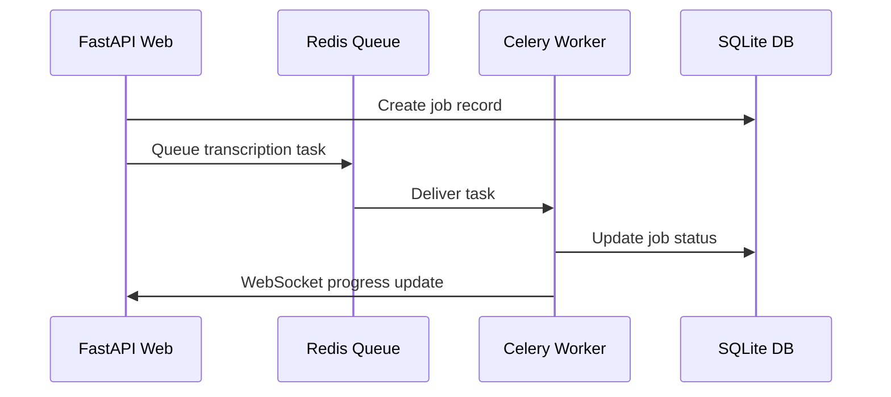
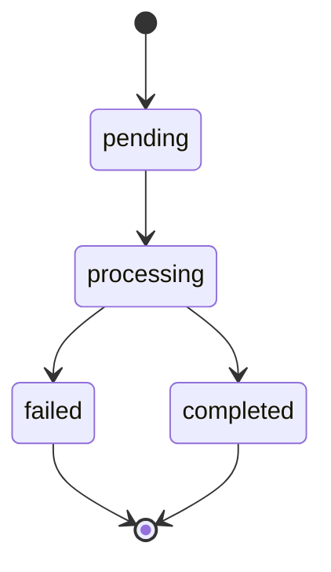

# Interface Control Document (ICD)

## 🔗 API Endpoints Overview

| Method | Path | Handler | Module |
|--------|------|---------|--------|
| `GET` | `/` | `unknown` | app.main |
| `POST` | `/token` | `unknown` | app.main |
| `POST` | `/register` | `unknown` | app.main |
| `POST` | `/change-password` | `unknown` | app.main |
| `GET` | `/health` | `unknown` | app.main |
| `GET` | `/metrics` | `unknown` | app.main |
| `GET` | `/stats` | `unknown` | app.main |
| `GET` | `/dashboard` | `unknown` | app.main |
| `POST` | `/transcribe` | `unknown` | app.main |
| `GET` | `/jobs/{job_id}` | `unknown` | app.main |
| `GET` | `/jobs/{job_id}/download` | `unknown` | app.main |
| `GET` | `/jobs` | `unknown` | app.main |
| `GET` | `/admin/jobs` | `unknown` | app.main |
| `DELETE` | `/jobs/{job_id}` | `unknown` | app.main |
| `GET` | `/health` | `unknown` | api.main |
| `GET` | `/version` | `unknown` | api.main |
| `GET` | `/admin/performance/summary` | `unknown` | api.performance_middleware |
| `GET` | `/admin/performance/queries` | `unknown` | api.performance_middleware |
| `GET` | `/admin/performance/metrics` | `unknown` | api.performance_middleware |
| `GET` | `/` | `unknown` | api.router_setup |
| `GET` | `/{full_path:path}` | `unknown` | api.router_setup |

*Total endpoints: 21*
## Table of Contents

1. [Internal APIs](#internal-apis)
2. [External APIs](#external-apis)
3. [Inter-Service Communication](#inter-service-communication)
4. [Data Contracts](#data-contracts)
5. [Version Compatibility](#version-compatibility)
6. [Change Management](#change-management)

---

## Internal APIs

### REST API Endpoints

#### Authentication & User Management

| Endpoint | Method | Version | Consumer | Provider | Stability |
|----------|--------|---------|----------|----------|-----------|
| `/token` | POST | 1.0 | Web UI, External clients | FastAPI Auth Module | Stable |
| `/register` | POST | 1.0 | Web UI | FastAPI Auth Module | Stable |
| `/change-password` | POST | 1.0 | Web UI | FastAPI Auth Module | Stable |

**POST /token**
```typescript
// Request
interface TokenRequest {
  username: string;
  password: string;
  grant_type?: "password";
}

// Response
interface TokenResponse {
  access_token: string;
  token_type: "bearer";
  expires_in?: number;
}

// Error Response
interface AuthError {
  detail: string;
  error_code?: "INVALID_CREDENTIALS" | "RATE_LIMITED";
}
```

**Consumers**: 
- Web UI (React components)
- Mobile PWA
- Automated testing scripts

**Provider**: `app.main:login()` (see: app/main.py:546-603)

**Stability Guarantee**: Stable - Breaking changes require major version bump

**Change Management**: 
- Additive changes (new optional fields) are allowed
- Field removal requires 6-month deprecation notice
- Response format changes require new endpoint version

---

#### Job Management

| Endpoint | Method | Version | Consumer | Provider | Stability |
|----------|--------|---------|----------|----------|-----------|
| `/transcribe` | POST | 1.0 | Web UI | FastAPI Job Module | Stable |
| `/jobs/{id}` | GET | 1.0 | Web UI | FastAPI Job Module | Stable |
| `/jobs/{id}` | DELETE | 1.0 | Web UI, Admin UI | FastAPI Job Module | Stable |
| `/jobs/{id}/download` | GET | 1.0 | Web UI | FastAPI Job Module | Stable |

**POST /transcribe**
```typescript
// Request (multipart/form-data)
interface TranscribeRequest {
  file: File;  // Audio file (mp3, wav, m4a, flac)
  model?: "tiny" | "small" | "medium" | "large-v3";
}

// Response
interface JobResponse {
  job_id: string;
  status: "pending" | "processing" | "completed" | "failed";
  filename: string;
  original_filename: string;
  model_used: string;
  created_at: string;  // ISO 8601
  file_size?: number;
}

// Error Response
interface JobError {
  detail: string;
  error_code?: "FILE_TOO_LARGE" | "INVALID_FORMAT" | "STORAGE_ERROR";
}
```

**Consumers**: 
- Web UI upload component
- Mobile file picker
- API testing tools

**Provider**: `app.main:create_transcription()` (see: app/main.py:720-780)

**Stability Guarantee**: Stable - Field additions only

---

#### Administrative

| Endpoint | Method | Version | Consumer | Provider | Stability |
|----------|--------|---------|----------|----------|-----------|
| `/admin/stats` | GET | 1.0 | Admin UI | FastAPI Admin Module | Stable |
| `/admin/reset` | POST | 1.0 | Admin UI | FastAPI Admin Module | Stable |
| `/health` | GET | 1.0 | Load balancers, Monitoring | FastAPI Health Module | Stable |
| `/metrics` | GET | 1.0 | Monitoring systems | FastAPI Metrics Module | Beta |

**GET /admin/stats**
```typescript
interface AdminStats {
  system: {
    uptime_seconds: number;
    version: string;
    environment: string;
  };
  database: {
    total_jobs: number;
    completed_jobs: number;
    failed_jobs: number;
    active_jobs: number;
  };
  storage: {
    total_files: number;
    total_size_bytes: number;
    available_space_bytes: number;
  };
  queue: {
    pending_tasks: number;
    active_workers: number;
  };
}
```

**Consumer**: Admin dashboard components  
**Provider**: `app.main:get_stats()` (see: app/main.py:760-800)  
**Stability**: Stable for system/database fields, Beta for queue fields

---

### WebSocket APIs

#### Real-time Progress Updates

| Endpoint | Protocol | Version | Consumer | Provider | Stability |
|----------|----------|---------|----------|----------|-----------|
| `/ws/progress/{job_id}` | WebSocket | 1.0 | Web UI | FastAPI WebSocket Handler | Stable |

**WebSocket Messages**
```typescript
// Progress Update (Server → Client)
interface ProgressUpdate {
  job_id: string;
  status: "processing" | "completed" | "failed";
  progress: number;  // 0-100
  message: string;
  timestamp: string;  // ISO 8601
  transcript?: string;  // Only when completed
  error?: string;  // Only when failed
}

// Connection Request (Client → Server)
interface ProgressSubscription {
  action: "subscribe";
  job_id: string;
}
```

**Consumer**: Progress monitoring components  
**Provider**: `app.main:ConnectionManager` (see: app/main.py:346-380)  
**Stability**: Stable - Message format guaranteed

**Connection Management**:
- Automatic reconnection on disconnect
- Heartbeat every 30 seconds
- Client timeout after 5 minutes of inactivity

---

## External APIs

### Celery Task Queue

**Interface**: Redis-based task queue  
**Provider**: Celery workers  
**Consumer**: FastAPI application  
**Protocol**: Redis pub/sub with JSON serialization

```python
# Task Definition
def transcribe_audio(job_id: str) -> dict:
    """
    Background transcription task
    
    Args:
        job_id: Unique job identifier
        
    Returns:
        dict: Task result with status and transcript
    """
    pass

# Task Invocation
result = transcribe_audio.delay(job_id="abc123")
```

**Task States**:
- `PENDING`: Task queued but not started
- `STARTED`: Worker has begun processing
- `SUCCESS`: Task completed successfully  
- `FAILURE`: Task failed with error
- `REVOKED`: Task cancelled

**Retry Policy**:
- Maximum 3 retries
- Exponential backoff: 1s, 4s, 16s
- Dead letter queue for permanent failures

---

### File System Interface

**Interface**: Local file system operations  
**Provider**: Operating system  
**Consumer**: FastAPI application, Celery workers

```python
# Storage Paths
UPLOAD_DIR = "storage/uploads"
TRANSCRIPT_DIR = "storage/transcripts"
MODEL_DIR = "models"

# File Operations
def save_upload(file: UploadFile, filename: str) -> Path:
    """Save uploaded file to storage"""
    
def get_transcript(job_id: str) -> str:
    """Retrieve transcript content"""
    
def cleanup_job_files(job_id: str) -> None:
    """Remove job-related files"""
```

**File Naming Conventions**:
- Uploads: `{job_id}_{original_filename}`
- Transcripts: `{job_id}_transcript.txt`
- Temporary: `{job_id}_temp_{timestamp}`

**Permissions**:
- Read/write access required for application user
- No special privileges needed
- Disk space monitoring recommended

---

### Database Interface

**Interface**: SQLite database with SQLAlchemy ORM  
**Provider**: SQLite engine  
**Consumer**: FastAPI application, Celery workers

```python
# Primary Tables
class Job(Base):
    __tablename__ = "jobs"
    id: str  # Primary key
    filename: str
    status: str
    transcript: str
    # ... other fields

class User(Base):
    __tablename__ = "users"
    id: int  # Primary key
    username: str
    password_hash: str
    role: str
```

**Connection Management**:
- WAL mode enabled for concurrent access
- Connection pooling with max 10 connections
- 30-second timeout for long queries
- Automatic retry on database locks

**Schema Migration**:
- Alembic-based migrations
- Backward compatibility for 2 major versions
- Data migration scripts for breaking changes

---

## Inter-Service Communication

### Web ↔ Worker Communication

**Mechanism**: Shared database + Redis queue  
**Pattern**: Asynchronous job submission with status polling



**Error Handling**:
- Dead letter queue for failed tasks
- Exponential backoff for retries
- Circuit breaker for database failures

### Web ↔ Database Communication

**Pattern**: Connection pooling with ORM  
**Isolation Level**: READ COMMITTED  
**Transaction Scope**: Per-request

```python
# Transaction Management
@contextmanager
def get_db_session():
    session = SessionLocal()
    try:
        yield session
        session.commit()
    except Exception:
        session.rollback()
        raise
    finally:
        session.close()
```

---

## Data Contracts

### Job State Machine



**State Transitions**:
- `pending → processing`: Worker starts transcription
- `processing → completed`: Transcription successful
- `processing → failed`: Error during transcription
- No transitions allowed from terminal states

### Error Response Format

```typescript
interface ErrorResponse {
  detail: string;          // Human-readable message
  error_code?: string;     // Machine-readable code
  timestamp: string;       // ISO 8601
  request_id?: string;     // For support tracing
  validation_errors?: {    // For 422 responses
    field: string;
    message: string;
  }[];
}
```

**Standard Error Codes**:
- `INVALID_CREDENTIALS`: Authentication failed
- `INSUFFICIENT_PERMISSIONS`: Authorization failed
- `VALIDATION_ERROR`: Request validation failed
- `RESOURCE_NOT_FOUND`: Requested resource missing
- `STORAGE_ERROR`: File system operation failed
- `QUEUE_ERROR`: Task queue operation failed

---

## Version Compatibility

### API Versioning Strategy

**Current Approach**: URL path versioning (implicit v1)  
**Future Strategy**: Explicit version headers

```http
# Current
POST /transcribe

# Future
POST /v2/transcribe
X-API-Version: 2.0
```

### Backward Compatibility

**Guaranteed Support**:
- Major version: 2 years
- Minor version: 1 year  
- Patch version: 6 months

**Breaking Changes**:
- Field removal from responses
- Required field addition to requests
- Endpoint URL changes
- Authentication method changes

**Non-Breaking Changes**:
- Optional field addition to requests
- Field addition to responses
- New endpoints
- Error message improvements

### Database Schema Evolution

**Migration Strategy**: Alembic with forward-only migrations  
**Rollback Support**: Manual scripts for critical migrations  
**Data Preservation**: All migrations must preserve existing data

```python
# Example Migration
def upgrade():
    # Add new column with default value
    op.add_column('jobs', sa.Column('duration', sa.Integer(), nullable=True))
    
def downgrade():
    # Remove column (data loss acceptable for new fields)
    op.drop_column('jobs', 'duration')
```

---

## Change Management

### Change Approval Process

1. **Proposal**: RFC document with impact analysis
2. **Review**: Architecture team review (minimum 2 approvers)
3. **Testing**: Integration tests with consumer validation
4. **Staging**: Deploy to staging environment for 1 week
5. **Production**: Gradual rollout with monitoring

### Breaking Change Protocol

1. **Deprecation Notice**: 3-month advance warning
2. **Sunset Date**: Clear timeline for removal
3. **Migration Guide**: Detailed upgrade instructions
4. **Support Window**: Parallel support during transition

### Consumer Notification

**Channels**:
- API documentation updates
- Email notifications to registered developers
- Slack channel announcements
- GitHub release notes

**Timeline**:
- Major changes: 3 months notice
- Minor changes: 1 month notice
- Security fixes: Immediate notification

### Monitoring and Rollback

**Key Metrics**:
- API response time percentiles
- Error rate by endpoint
- Consumer adoption rates
- Database query performance

**Rollback Triggers**:
- Error rate > 5% for any endpoint
- Response time degradation > 50%
- Consumer complaints > 3 in 24 hours
- Critical security vulnerability

**Rollback Process**:
1. Immediate: Feature flag disable
2. Short-term: Code rollback to previous version
3. Long-term: Database migration rollback if needed

---

*This ICD should be updated for all interface changes and reviewed quarterly for accuracy.*
