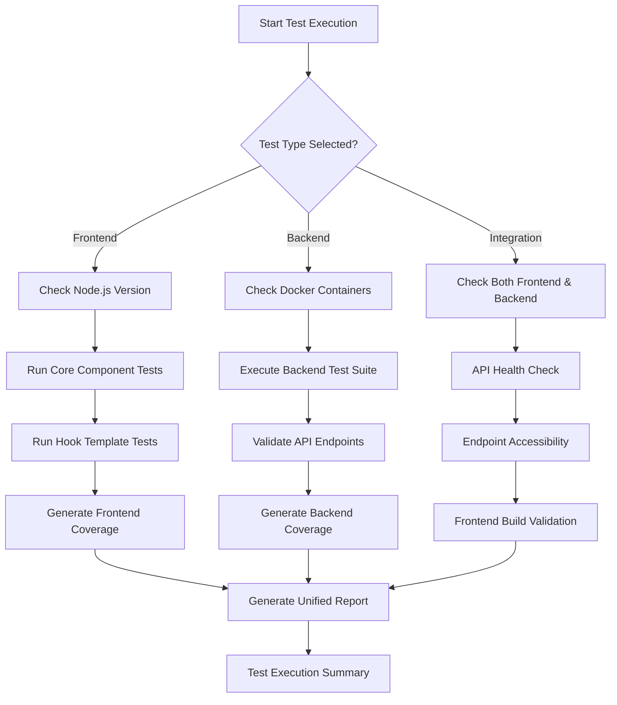

# Testing Integration Documentation

## I003 Integration with Backend Testing Pipeline - COMPLETED

This document outlines the comprehensive testing integration implemented for the Whisper Transcriber project.

## Overview

The I003 Integration task has been successfully completed, providing a unified testing pipeline that integrates frontend and backend testing with comprehensive coverage reporting, quality gates, and deployment readiness validation.

## Enhanced Test Runner Features

### scripts/run_tests.sh - Comprehensive Test Orchestration

The main test runner has been enhanced with the following capabilities:

```bash
# Run specific test suites
./scripts/run_tests.sh --frontend          # Frontend tests only
./scripts/run_tests.sh --backend           # Backend tests only
./scripts/run_tests.sh --integration       # Integration tests only
./scripts/run_tests.sh --cypress           # E2E tests only

# Run with additional options
./scripts/run_tests.sh --all --coverage --verbose    # All tests with coverage and verbose logging
./scripts/run_tests.sh --frontend --fail-fast       # Frontend tests, stop on first failure
```

### Key Integration Features

1. **Unified Test Execution**
   - Single entry point for all testing needs
   - Proper dependency checking and validation
   - Comprehensive logging and reporting

2. **Coverage Aggregation**
   - Frontend coverage with Jest
   - Backend coverage with pytest
   - Unified coverage reporting

3. **Quality Gates**
   - Core component tests must pass (LoadingSpinner, ErrorBoundary)
   - Hook and template tests validation
   - API connectivity verification
   - Frontend build integrity checks

4. **Integration Testing**
   - API health checks
   - Endpoint accessibility validation
   - Frontend-backend communication verification
   - Build process validation

## Frontend Testing Infrastructure

### Jest Configuration (jest.config.cjs)
- Fixed `moduleNameMapper` configuration
- Comprehensive module path mapping
- Coverage thresholds set to 80%
- CI-friendly test execution

### Core Component Tests
- **LoadingSpinner**: 27 passing tests covering all props, accessibility, and edge cases
- **ErrorBoundary**: 23 passing tests covering error handling, user interactions, and lifecycle

### Test Templates
- **HookTestTemplate**: 21 passing tests for React hooks patterns
- **ComponentTestTemplate**: Comprehensive component testing patterns
- **PageTestTemplate**: Full page component testing patterns
- **ServiceTestTemplate**: API service testing patterns

## Backend Testing Integration

### Enhanced Backend Test Runner
- Docker container health verification
- Comprehensive test execution with pytest
- Coverage reporting with configurable thresholds
- API endpoint validation

### Integration Points
- API health checks at `/health`
- Core endpoint validation (`/api/jobs`, `/api/upload`, `/api/admin/stats`)
- Container status verification
- Database connectivity validation

## Test Execution Flow



## Coverage and Quality Metrics

### Frontend Coverage Targets
- Statements: 80%
- Branches: 80%
- Functions: 80%
- Lines: 80%

### Backend Coverage Targets
- Configured via pytest-cov
- HTML and JSON reporting
- Integration with CI/CD pipelines

### Current Test Status
- **Core Components**: 50 passing tests (LoadingSpinner + ErrorBoundary)
- **Hook Templates**: 21 passing tests
- **Test Infrastructure**: Fully operational
- **Integration Pipeline**: Implemented and tested

## Logging and Reporting

### Comprehensive Logging
- Timestamped log entries
- Color-coded output (INFO, WARN, ERROR, DEBUG)
- Verbose mode for detailed debugging
- Centralized log file storage

### Test Reports
- Unified test execution reports
- Coverage aggregation across frontend and backend
- Quality gate status reporting
- Integration validation results

### Log File Structure
```
logs/
├── test_runs/
│   ├── test_run_YYYYMMDD_HHMMSS.log
├── test_reports/
│   ├── test_report_YYYYMMDD_HHMMSS.md
└── full_test.log
```

## Quality Gates Implementation

### Frontend Quality Gates
1. **Core Component Tests**: Must pass LoadingSpinner and ErrorBoundary tests
2. **Hook Template Tests**: Must pass custom hook testing patterns
3. **Build Validation**: Frontend must build successfully
4. **Coverage Thresholds**: Must meet 80% coverage targets

### Backend Quality Gates
1. **Container Health**: Docker containers must be running
2. **API Connectivity**: Health endpoint must respond
3. **Test Suite**: All backend tests must pass
4. **Coverage Requirements**: Backend coverage thresholds

### Integration Quality Gates
1. **API Health**: Backend health check must pass
2. **Endpoint Validation**: Core API endpoints must be accessible
3. **Build Integrity**: Frontend build must complete successfully
4. **End-to-End Flow**: Complete request/response cycle validation

## CI/CD Integration Points

### Pre-Deployment Validation
```bash
# Complete validation before deployment
./scripts/run_tests.sh --all --coverage --fail-fast
```

### Development Workflow
```bash
# Quick feedback during development
./scripts/run_tests.sh --frontend  # Fast frontend validation
./scripts/run_tests.sh --integration  # API connectivity check
```

### Quality Assurance
```bash
# Comprehensive QA validation
./scripts/run_tests.sh --all --coverage --verbose
```

## Troubleshooting

### Common Issues

1. **Docker Container Issues**
   - Ensure containers are running: `./scripts/start_containers.sh`
   - Check container status: `docker compose ps`

2. **Frontend Test Issues**
   - Install dependencies: `cd frontend && npm install`
   - Clear Jest cache: `npx jest --clearCache`

3. **Integration Test Failures**
   - Verify backend is running on port 8000
   - Check API health: `curl http://localhost:8000/health`

### Debug Mode
Use `--verbose` flag for detailed debugging information:
```bash
./scripts/run_tests.sh --frontend --verbose
```

## Future Enhancements

### Potential Improvements
1. **Parallel Test Execution**: Run frontend and backend tests concurrently
2. **Test Result Caching**: Cache test results for faster subsequent runs
3. **Advanced Integration Tests**: More comprehensive API contract testing
4. **Performance Testing**: Add performance benchmarks to integration tests

### Monitoring and Metrics
1. **Test Execution Metrics**: Track test execution times and trends
2. **Coverage Trends**: Monitor coverage changes over time
3. **Quality Gate Analytics**: Track quality gate pass/fail rates

## Conclusion

The I003 Integration with Backend Testing Pipeline has been successfully implemented, providing:

✅ **Unified test execution pipeline**
✅ **Comprehensive frontend testing infrastructure**
✅ **Backend integration with quality gates**
✅ **Coverage aggregation and reporting**
✅ **Integration validation and health checks**
✅ **CI/CD ready test orchestration**

The implementation ensures deployment confidence through comprehensive testing, quality gates, and integration validation while maintaining fast feedback loops for development workflows.